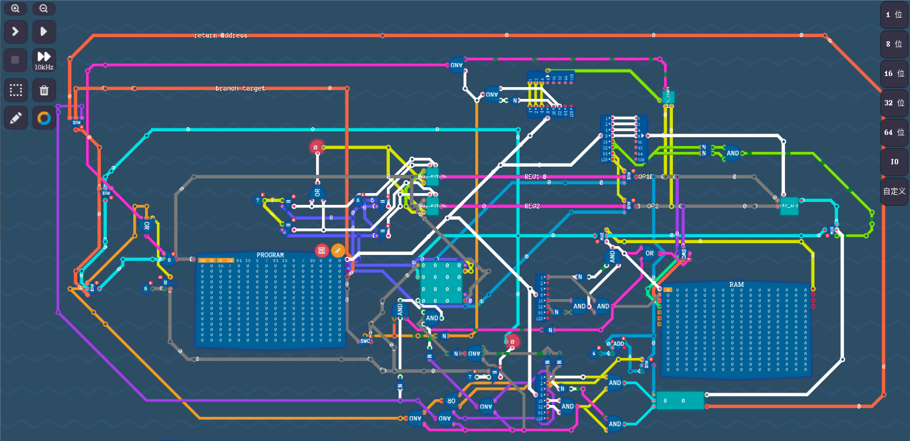

# LEG_Codes 

LEG is an 8-bit ISA. You can directly play it in Steam game 'Turing Complete'. Find Hfcloud-LEG in the sharing center.

See exported verilog codes in folder 'verilog'

Hfcloud-LEG by HfCloud(or sxysxy) is marked with CC0 1.0 

## Basic Configurations

A 256-byte program memory.

A 256-byte data memory.

A 256-byte stack memory.

8-bit machine word length.

## Registers:

13 regular registers in total: R1-R5,R8-R14

R6 is PC (Program Counter)

R7 is IO (Input Output)

R15 is always zero. (Even if you use instruction to write it, it will keep to be zero all the time) 

## Instruction Format:

Each instruction has fixed 4 bytes.

The form of one 4-byte instruction is:

Opcode reg1/imm1, reg2/imm2, reg3

Each the component occupies 1 byte.

## Load/Store：

Load(_r)      Unused,    addr(reg/imm)，  target_reg

    Opcode: 00010000(addr in reg) 01010000(addr is imm)
Load data from addr(im memory) to target_reg

Store(_r)     reg/imm,   addr(reg/imm),   Unused

    Opcode: 00010001(addr in reg) 01010001(addr is imm)
Store reg/imm to addr

Note: As for Store instruction, the addr could not be store in IP or IO.

## Arithmetic

Note: The 4-th and 5-th(indices start from 0) bits should be 0 for arithmetic instructions. The 7-th and 6-th bit (xx) indicates the data source for the first and second source operands. (0 for reg, 1 for imm)

Add       reg/imm, reg/imm, target_reg

    Opcode: xx000000

Sub       reg/imm, reg/imm, target_reg

    Opcode: xx000001

And       reg/imm, reg/imm, target_reg

    Opcode: xx000010

Or       reg/imm, reg/imm, target_reg

    Opcode: xx000011

Not       reg/imm, target_reg

    Opcode: xx000100

Xor       reg/imm, reg/imm, target_reg

    Opcode: xx000101

Shl		 reg/imm, reg/imm, target_reg

    Opcode: xx000110

Shr       reg/imm, reg/imm, target_imm

    Opcode: xx000111

Rol		 reg/imm, reg/imm, target_reg

    Opcode: xx001000

Ror		 reg/imm, reg/imm, target_reg

    Opcode: xx001001

Mul		 reg/imm, reg/imm, target_reg

    Opcode: xx001010
Overflowed bits will be discard

## Branch 

Note: xx for the source operand(0 reg, 1 imm).

eq: equal, ne: not equal, lt: less than, le : less or equal, gt : greater than, ge: greater or equal

Jeq reg/imm, reg/imm, target_addr(imm)

    Opcode: xx100000

Jne reg/imm, reg/imm, target_addr(imm)

    Opcode: xx100001

Jlt reg/imm, reg/imm, target_addr(imm)

    Opcode: xx100010

Jle reg/imm, reg/imm, target_addr(imm)

    Opcode: xx100011

Jgt reg/imm, reg/imm, target_addr(imm)

    Opcode: xx100100

Jge reg/imm, reg/imm, target_addr(imm)

    Opcode: xx100101

Jump target_addr(imm)

    Opcode: xx100110 Unused-8bit Unused-8bit Imm

## Stack Operations

Push reg/imm, unused, unused

    Opcode: xx110000 reg Unused-8bit Unused-8bit

Pop unused, unused, target_reg

    Opcode: xx110001 Unused-8bit Unused-8bit reg

Call pc, unused, addr(imm)

    Opcode: xx110010 00000110 Unused-8bit imm

Ret unused, unused, unused

    Opcode: xx110101 Unused-8bit Unused-8bit Unused-8bit

